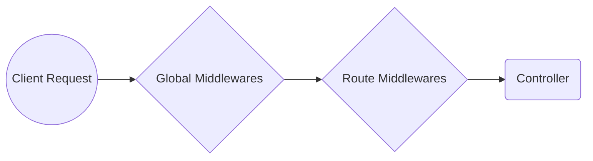
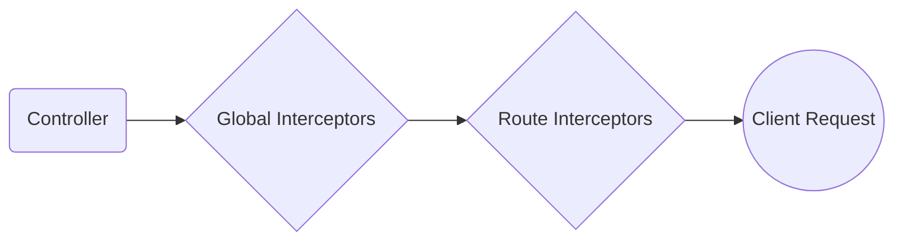
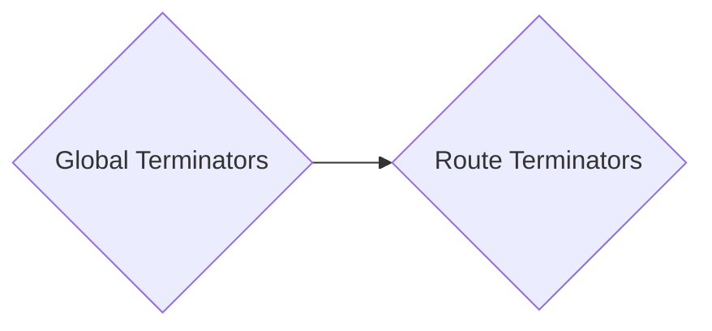
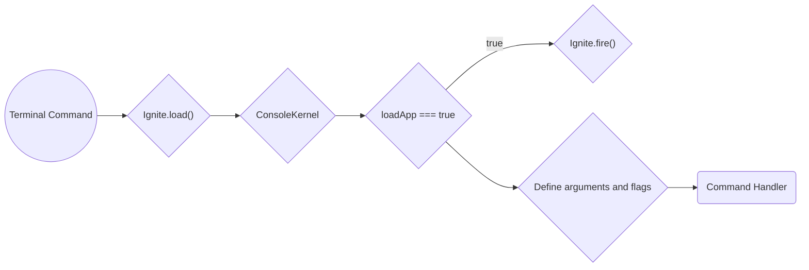
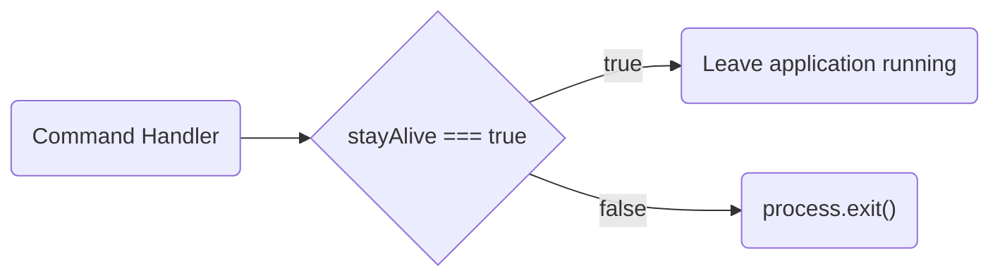

import ThemedImage from '@theme/ThemedImage'

# Application Lifecycle

Understand each one of the Athenna applications lifecycle.

## Introduction

When using any tool in the "real world", you feel more confident if
you understand how that tool works. Application development is no
different. When you understand how your development tools function,
you feel more comfortable and confident using them.

The goal of this document is to give you a good, high-level overview
of how the Athenna framework works. By getting to know the overall
framework better, everything feels less "magical" and you will be more
confident building your applications. If you don't understand all the
terms right away, don't lose heart! Just try to get a basic grasp of
what is going on, and your knowledge will grow as you explore other
sections of the documentation.

## Athenna foundation lifecycle

The Athenna foundation is everything that is not coupled to the type of
application you are using. Meaning that no matter what is the type of
application you are using to build your solution, the explanation bellow
is valid for all of them.

The entry point of an Athenna application is the `bootstrap/main.ts`
file in the default project structure and `bin/main.ts` in slim project
structure. The first action taken by Athenna itself is to create an
instance of the application and then boot it.

## Loading the foundation

### Rc file

The RC file is the first thing Athenna will do when booting the
application. The RC file is responsible to configure your entire
workspace and certain runtime settings of your application.

### Other operations

Some other operation will be done when loading the foundation, such as:

1. Verify if your [engines in `package.json`](https://docs.npmjs.com/cli/v9/configuring-npm/package-json#engines) is supported.
2. Register the Athenna logger provider.
3. Register an uncaught exception handler.
4. Define your application root path.
5. Register `Ignite` class in the service container.
6. Define application signals for graceful shutdown.

:::note

The process of loading the Athenna foundation is triggered by the
`Ignite.load` method.

:::

### Firing the foundation

The Athenna foundation will automatically be fired internally depending
on the type of application you are using, let's see all the operations
executed in order to get Athenna foundation done:

#### Environment variables

The first thing Athenna will do when firing the foundation is to load
your environment variables files. You can learn more about what is and
how to configure your environment variables in [the environment
configuration documentation section](/docs/getting-started/configuration#environment-configuration).

#### Configuration files

Afterwards Athenna will load all the configuration files found inside
the path returned by the `Path.config` method. You can learn more about
what is and how to configure your configuration files in
[the configuration files documentation section](/docs/getting-started/configuration#configuration-files).

#### Service providers

One of the most important kernel bootstrapping actions is loading the
service providers for your application. All the service providers for
the application are configured in the `.athennarc.json` in the
`providers` array.

Athenna will iterate through this list of providers and instantiate each
of them. After instantiating the providers, the `register` method will
be called on all the providers. Then, once all the providers have been
registered, the `boot` method will be called on each provider. This is
so service providers may depend on every container binding being
registered and available by the time their boot method is executed.

Service providers are responsible for bootstrapping all the frameworks
various components, such as the database, http server, validation,
services and routing components. Essentially, every major feature
offered by Athenna is bootstrapped and configured by a service
provider. Since they bootstrap and configure so many features offered
by the framework, service providers are the most important aspect of
the entire Athenna bootstrap process.

#### Preloads

Preload files are loaded at the time of booting the application. The
files are loaded right after booting the service providers. A preload
file could be useful to execute some operation before bootstrapping
the application. All the preloads for the application are configured
in the `.athennarc.json` in the `preloads` array.

:::note

The process of firing the Athenna foundation is triggered by the
`Ignite.fire` method. But if you check your `main.ts` entrypoint file,
you will see that this method is not called directly. The reason for
this is that this method is called internally depending on the type of
application you are using. Let's cover some examples bellow:

- The `REST API` application needs to fire the foundation first because
it depends on service providers to register your controllers, services,
middlewares, routes, etc.

- The `cli` application and Artisan commands does not fire the foundation
because commands do not depends on registering providers, loading
environment variables and configuration files, for example. But, if your
command got the `loadApp` equals true in `.athennarc.json`, the foundation
will be fired before executing your command.

:::

## REST API lifecycle

### Kernel

The Kernel class is responsible by defining some bootstraps that will
be run before reading your `routes/http.ts` file. These bootstraps
configure error handling for requests, tracing and logging, detect the
application environment, and perform other tasks that need to be done
before the request is actually handled. Typically, these classes handle
internal Athenna configuration that you do not need to worry about.

The Kernel is also responsible by registering your middlewares and
controllers defined in your `.athennarc.json` file. By default, Athenna
will always use the default implementation `HttpKernel` class imported
from `@athenna/http` package. If you prefer, you can create your custom
Kernel implementation, extending the default `HttpKernel` class and
registering it in your `Ignite.httpServer` method call:

```typescript
import { HttpKernel } from '@athenna/http'

export class CustomKernel extends HttpKernel {
}
```

:::note

You can check all the methods available for you to override in your
custom kernel implementation taking a look at [HttpKernel](https://github.com/AthennaIO/Http/blob/develop/src/kernels/HttpKernel.ts)
implementation code.

:::

Then, you can register your `CustomKernel` in your `bootstrap/main.ts`
file:

```typescript
import { Ignite } from '@athenna/core'

const ignite = await new Ignite().load(import.meta.url)

await ignite.httpServer({ kernelPath: '#app/http/CustomKernel' })'
```

### Routes

The `routes/http.ts` file is the entrypoint for all your http requests.
This file is responsible to create a contract between your client and
your application. It Is in here that we define all our routes and the
handlers/controllers who will handle the client request.

One of the most important service providers in your application is the
`HttpRouteProvider`. This service provider adds in the container the
`Route` class instance used inside `routes/http.ts` file.

When the client request arrives, the server first executes all your
global middlewares, then it will execute all your route middlewares.
Once it finishes, it goes for your handler/controller. See the example:



### Finish up

Once the controller/handler function returns a response, the response will
travel back outward through each global interceptor, and then route's
interceptor, giving the application a chance to modify or examine the
outgoing response. See the example:



As you can see in the example, the response content is sent to the client. The
request finishes for the client but not for the server. Now it's time to
execute the global and route terminators. The terminators are executed when a
response has been sent, so you will not be able to send more data to the
client. It can, however, be useful for sending data to external services, for
example, create metrics of the entire request. See the example:



Finally, once all terminators are executed, the request finishes in the
server. We've finished our journey through the entire REST API lifecycle 🥳.

## Cli and Commands lifecycle

### Kernel

The Kernel class is responsible for defining some bootstraps that will be run
before registering your commands. These bootstraps configure error handling
for commands, detect the application environment, and perform other tasks that
need to be done before the command is actually handled. Typically, these
classes handle internal Athenna configuration that you do not need to worry
about.

The Kernel is also responsible for registering your commands defined in your
`.athennarc.json` file. By default, Athenna will always use the default
implementation `ConsoleKernel` class imported from `@athenna/http` package. If
you prefer, you can create your custom Kernel implementation, extending the
default ConsoleKernel class and registering it in your `Ignite.artisan` method
call:

```typescript
import { ConsoleKernel } from '@athenna/http'

export class CustomKernel extends ConsoleKernel {
}
```

:::note

You can check all the methods available for you to override in your custom
kernel implementation taking a look at [ConsoleKernel](https://github.com/AthennaIO/Artisan/blob/develop/src/kernels/ConsoleKernel.ts) implementation code.

:::

Then, you can register your `CustomKernel` in your `bootstrap/main.ts` or
`bootstrap/artisan.ts` file:

```typescript
import { Ignite } from '@athenna/core'

const ignite = await new Ignite().load(import.meta.url, {
  bootLogs: false
})

await ignite.artisan({ kernelPath: '#app/http/CustomKernel' })
```

### Execution

The `routes/console.ts` and the `commands` property of `.athennarc.json` file
is where that we define all ours commands and the handlers who will handle
the terminal arguments.

When the terminal arguments arrive, the application will be bootstrapped
based on the command that you are asking to execute. Let's suppose we have
executed the `hello` command defined in our `.athennarc.json` file:

```json
{
  "commands": {
    "hello": {
      "path": "#app/console/commands/HelloCommand",
      "loadApp": false,
      "stayAlive": false,
      "loadAllCommands": false,
      "environments": ["console"]
    }
  }
}
```

Since `loadAllCommands` is set to false, the Kernel will load only the `hello`
command and execute it:



### Finish up

Once the command handler function finish, Athenna will verify if the `stayAlive`
setting is set to true, if so, the application will not be terminated, very
useful when running command like `repl` and `serve`.



We've finished our journey through the entire command lifecycle 🥳.

## Focus on service providers

Service providers are truly the key to bootstrapping an Athenna application.
The application instance is created, the service providers are registered, and
the request is handed to the bootstrapped application. It's really that simple!

Having a firm grasp of how an Athenna application is built and bootstrapped via
service providers is very valuable. Your application's default service providers
are stored in the `providers` directory, and you can create your own provider
with the following command:

```shell
./node artisan make:provider AppProvider
```

With this new provider you can add your application's own bootstrapping and
service container bindings. For large applications, you may wish to create
several service providers, each with more granular bootstrapping for specific
services used by your application.
