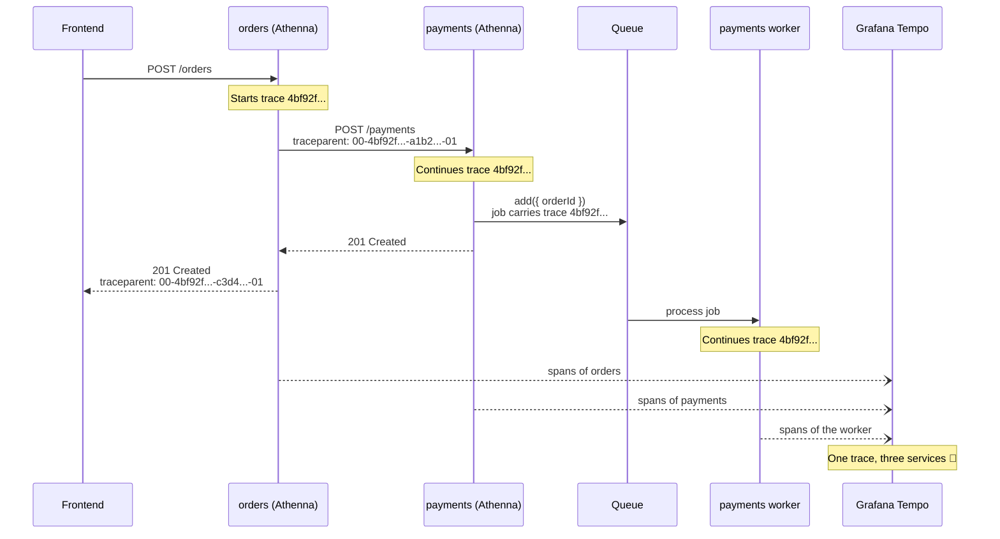

import Path from '@site/src/components/path'

# Distributed Tracing

See how to follow a single request across multiple Athenna applications.

## Introduction

As your company grows, a single user action rarely stays inside a
single application. Imagine an e-commerce with two Athenna services:

- **orders**: a REST API that receives `POST /orders` from the frontend.
- **payments**: a REST API that charges the customer and, after
  that, dispatches a queue job to send the receipt by email.

When a customer says that their checkout took 10 seconds, which of
these services was slow? Without distributed tracing, you would have
to open the logs of each service, try to match them by timestamp, and
hope for the best. With distributed tracing, you search for **one**
trace ID and see the whole journey in a single screen:

```
orders    POST /orders                              [==============================] 10.2s
orders    ├── OrderService.create                    [=====]                           1.1s
orders    │   └── pg.query INSERT orders              [==]                             0.2s
orders    └── POST http://payments:3001/payments            [=======================]  9.0s
payments      └── POST /payments                            [=======================]  8.9s
payments          ├── PaymentService.charge                  [=====================]   8.7s  👈 here!
payments          └── queue.process.receipts                                     [=]   0.1s
```

The best part? If all your services use Athenna and `@athenna/otel`,
you don't need to write a single line of code for this to work. ✨

## How does it work?

When a trace starts in one service, it receives a unique **trace ID**.
For the next service to know that it's part of the same trace, the
trace ID needs to travel together with the request. OpenTelemetry does
this using the [W3C Trace Context](https://www.w3.org/TR/trace-context/)
standard, which defines the `traceparent` HTTP header:

```
traceparent: 00-4bf92f3577b34da6a3ce929d0e0e4736-00f067aa0ba902b7-01
             │  │                                │                └ flags (sampled)
             │  │                                └ parent span ID
             │  └ trace ID
             └ version
```

This is what happens behind the scenes:



Each service sends its own spans to your backend independently. Since
all of them share the same trace ID, your backend can stitch them back
together in the right order.

## Tracing between Athenna applications

When the [auto instrumentations](/docs/observability/getting-started#auto-instrumentations)
are enabled, every outgoing HTTP call automatically receives the
`traceparent` header of the active span, and every incoming HTTP request
automatically continues the trace of its `traceparent` header.

This works with the Athenna [`HttpClient`](/docs/the-basics/helpers)
helper, with the native `fetch` and with any library built on top of
`node:http` or `undici`. So in the **orders** service, this is
everything you need:

```typescript title="Path.services('PaymentService.ts')"
import { Env } from '@athenna/config'
import { Service } from '@athenna/ioc'
import { HttpClient } from '@athenna/common'

@Service()
export class PaymentService {
  public async charge(order: Order) {
    const response = await HttpClient.post(`${Env('PAYMENTS_URL')}/payments`, {
      body: { orderId: order.id, amount: order.total }
    })

    return response.body
  }
}
```

And in the **payments** service, nothing changes in your controller.
The `POST /payments` span will automatically become a child of the
`POST http://payments:3001/payments` span of the **orders** service.

:::tip

Give each one of your services a different `sdk.serviceName` in their
<Path father="config" child="otel.ts" /> file. This is how you will know
which service created each span in your tracing tool.

:::

### The `traceparent` response header

When the `OtelTerminator` is registered in your REST API application,
Athenna also sends the `traceparent` header in every **response**. This
allows your frontend, your API gateway or even your customers to know
the trace ID of a request, which is extremely useful when reporting
bugs. Check the [REST API observability](/docs/rest-api-application/observability)
documentation to see how to register it.

## Tracing through queues

Distributed tracing doesn't stop at HTTP calls. When you add a job to a
queue using [`@athenna/queue`](https://www.npmjs.com/package/@athenna/queue)
while OpenTelemetry is enabled, Athenna automatically stores the trace
context and all the [context values](/docs/observability/context) of the
current operation together with the job:

```typescript title="Path.controllers('PaymentController.ts')"
import { Inject } from '@athenna/ioc'
import { Queue } from '@athenna/queue'
import { Controller, type Context } from '@athenna/http'
import { PaymentService } from '#src/services/PaymentService'

@Controller()
export class PaymentController {
  @Inject()
  private paymentService: PaymentService

  public async store({ request, response }: Context) {
    const payment = await this.paymentService.charge(request.body)

    await Queue.connection('receipts').add({ paymentId: payment.id })

    return response.status(201).send(payment)
  }
}
```

When the job is processed by a worker, Athenna restores everything and
runs your worker inside a new span named `queue.process.{name}`, as a
child of the span that dispatched the job. Your worker receives the
original data of the job, as if nothing happened:

```typescript title="src/workers/ReceiptWorker.ts"
import { Log } from '@athenna/logger'
import { Otel } from '@athenna/otel'
import { Worker, type Context } from '@athenna/queue'

@Worker({ connection: 'receipts' })
export class ReceiptWorker {
  public async handle(ctx: Context) {
    Log.info(ctx.job.data) // { paymentId: '...' }
    Log.info(ctx.traceId) // same trace ID of the HTTP request
    Log.info(Otel.getCurrentContextValue('tenantId')) // tenant-1

    // ...
  }
}
```

This works even when the job is dispatched by one application and
processed by another one, as long as both of them use `@athenna/queue`
with the same broker, like AWS SQS or a shared database.

To enable it, set `otel.contextEnabled` to `true` in your
<Path father="config" child="worker.ts" /> configuration file:

```typescript title="Path.config('worker.ts')"
export default {
  otel: {
    contextEnabled: true,
    contextBindings: [
      { key: 'jobId', resolve: ctx => ctx.job.id }
    ]
  }
}
```

## Propagating the context manually

For anything that is not covered automatically, like a Kafka topic, a
WebSocket message or a webhook sent to a partner, you can propagate the
context yourself. The idea is always the same: **inject** the context
into a carrier object on one side, and **extract** it on the other side.

```typescript title="Producer"
import { Otel } from '@athenna/otel'

const headers = Otel.injectContext({})

// { traceparent: '00-4bf92f3577b34da6a3ce929d0e0e4736-00f067aa0ba902b7-01' }

await kafka.send({ topic: 'orders', messages: [{ value, headers }] })
```

```typescript title="Consumer"
import { Otel } from '@athenna/otel'

consumer.run({
  eachMessage: async ({ message }) => {
    await Otel.withExtractedContext(message.headers, async () => {
      await Otel.record('orders.consume', () => handle(message.value))
    })
  }
})
```

| Method                                              | Description                                                                    |
|:----------------------------------------------------|:-------------------------------------------------------------------------------|
| `Otel.injectContext(carrier, ctx?)`                 | Writes the trace context (`traceparent`) of the active context into `carrier`. |
| `Otel.extractContext(carrier, ctx?)`                | Returns a new context continuing the trace found in `carrier`.                 |
| `Otel.withExtractedContext(carrier, callback, options?)` | Runs `callback` inside the extracted context. Accepts the same `bindings` of `Otel.withContext()`. |

## Running Grafana locally

The easiest way to see all of this in action is using the
[`grafana/otel-lgtm`](https://github.com/grafana/docker-otel-lgtm)
Docker image. It runs an OpenTelemetry Collector, Grafana Tempo (traces),
Grafana Loki (logs), Prometheus (metrics) and Grafana in a single container,
ready to receive OTLP data:

```bash
docker run -p 3000:3000 -p 4317:4317 -p 4318:4318 --rm -ti grafana/otel-lgtm
```

Then point your application to it in your `.env` file:

```bash title=".env"
OTEL_ENABLED=true
OTEL_EXPORTER_OTLP_URL=http://localhost:4318
```

Start your application, make some requests and open Grafana at
`http://localhost:3000`. In the **Explore** page you can:

- Select the **Tempo** data source to search your traces by service
  name, span name, duration or by trace ID.
- Select the **Loki** data source to search the logs sent by the `otel`
  log driver, filtering them by any field, including `traceId`.
- Select the **Prometheus** data source to query your custom metrics.

### Running multiple services

To see a distributed trace, run the `orders` and `payments` services of
our example together with Grafana using Docker Compose:

```yaml title="compose.yml"
services:
  lgtm:
    image: grafana/otel-lgtm
    ports:
      - '3000:3000'
      - '4317:4317'
      - '4318:4318'

  orders:
    build: ./orders
    ports:
      - '3333:3333'
    environment:
      PORT: 3333
      OTEL_ENABLED: true
      OTEL_EXPORTER_OTLP_URL: http://lgtm:4318
      PAYMENTS_URL: http://payments:3001
    depends_on:
      - lgtm
      - payments

  payments:
    build: ./payments
    environment:
      PORT: 3001
      OTEL_ENABLED: true
      OTEL_EXPORTER_OTLP_URL: http://lgtm:4318
    depends_on:
      - lgtm
```

Now make a request to the **orders** service and copy the trace ID from
the `traceparent` response header:

```bash
curl -i -X POST http://localhost:3333/orders

# HTTP/1.1 201 Created
# traceparent: 00-4bf92f3577b34da6a3ce929d0e0e4736-c3d4e5f6a7b8c9d0-01
```

Paste `4bf92f3577b34da6a3ce929d0e0e4736` in the Tempo search of Grafana
and enjoy watching your request travel across your services. 🚀
